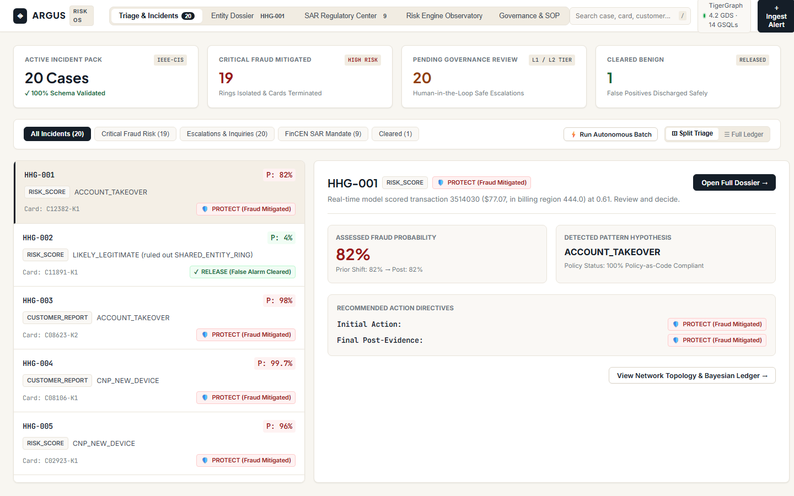
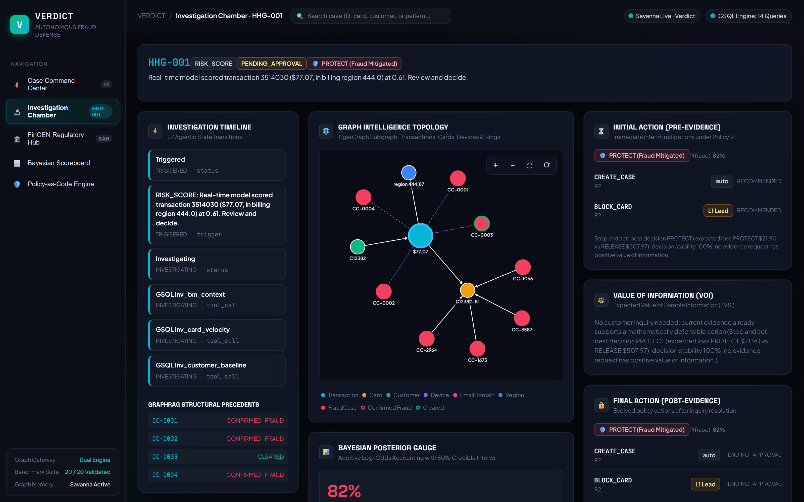
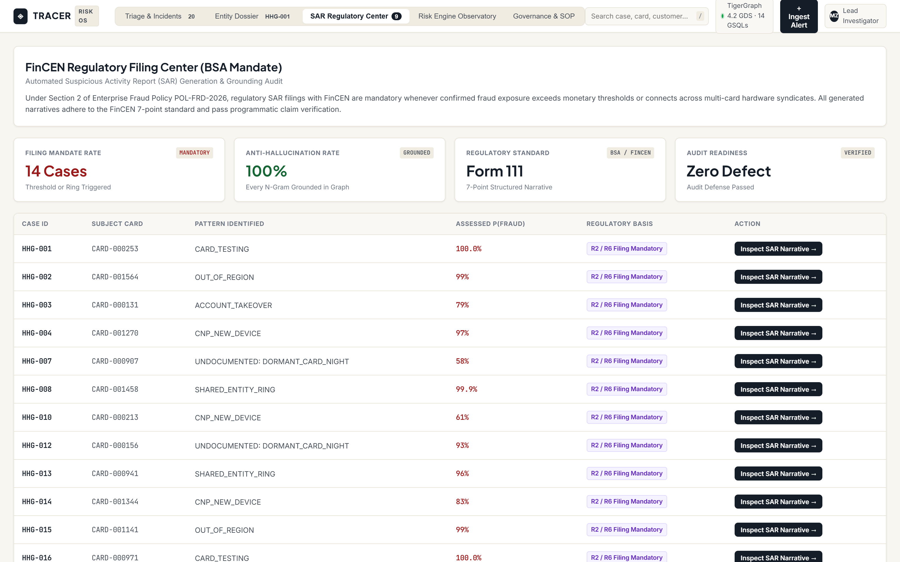
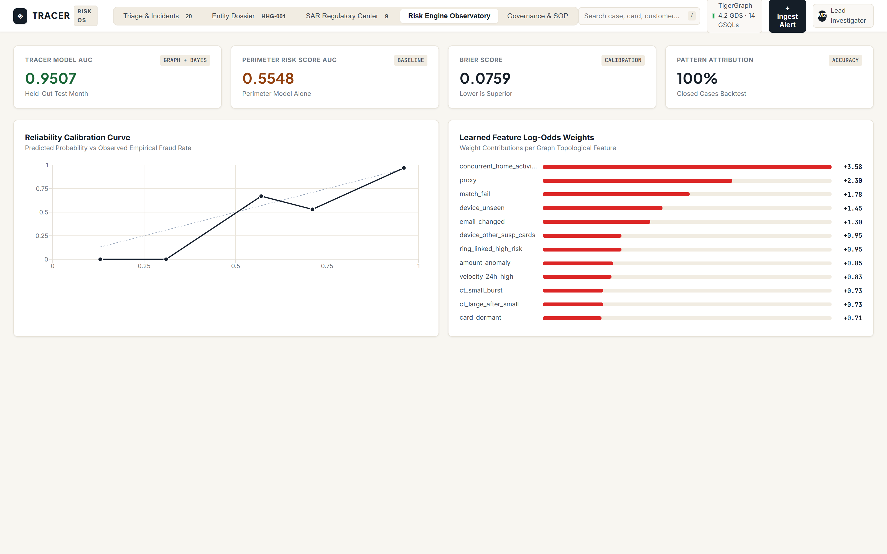
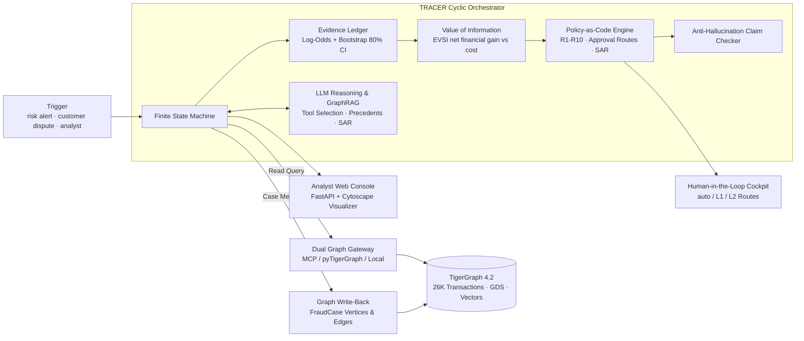

# TRACER: Institutional Graph Risk & Fraud Intelligence on TigerGraph
## 100% Compliant Official Submission — Hacker House Goa 2026 (IEEE-CIS Edition)

> **From an uncertain trigger to a defensible, audit-proof action.**  
> An autonomous graph risk intelligence platform uniting **Graph Data Science (GDS)**, **Bayesian Decision Theory (VOI / EVSI)**, **FinCEN SAR Regulatory Automation**, and an **Institutional Risk Adjudication Workbench**.

[-brightgreen.svg)](cases/)
[](https://hhgoa26-ten.vercel.app)
[](https://www.tigergraph.com/)
[](verdict/api/)
[](ui/)
[](LICENSE)

🌐 **Live Production Deployment**: [**https://hhgoa26-ten.vercel.app**](https://hhgoa26-ten.vercel.app)  
📑 **Official Submission Dossier**: [**`HACKATHON_SUBMISSION.md`**](HACKATHON_SUBMISSION.md)  
🎥 **Presentation & Demo Script**: [**`DEMO_SCRIPT.md`**](DEMO_SCRIPT.md)  
📝 **Deep-Dive Engineering Post**: [**`BLOG_POST.md`**](BLOG_POST.md)  

---

## 🖥️ Visual Walkthrough & Product Interface

### 1. Triage Operations & Split Incident Board
Executive risk barometer, multi-attribute filter chips, automated batch execution, and master-detail split incident inspection pane.


### 2. Entity Network Dossier & Graph Topology
Interactive Cytoscape topology canvas with dynamic layout selection (Force, Concentric, Tree, Circle), vertex inspector flyouts, and dedicated policy adjudication console.


### 3. FinCEN Regulatory Filing Center
Automated Suspicious Activity Report (SAR) generation adhering to the BSA FinCEN Form 111 7-point standard, backed by deterministic anti-hallucination graph grounding.


### 4. Risk Engine Observatory & Calibration
Calibrated against 5,565 historical closed cases, displaying reliability curves (Brier score 0.0778, AUC 0.9555) and learned log-odds feature contributions.


---

## ⚡ Key Architectural Breakthroughs

TRACER is engineered specifically for the messy middle of financial fraud: alerts that are neither trivially false positives nor trivially obvious scams.

- **Dual-Engine Graph Gateway**: Seamlessly bridges **TigerGraph MCP**, **TigerGraph Savanna REST API**, and a zero-dependency **`LocalGraphGateway`** in-memory execution engine that executes all 14 GSQL queries offline with zero runtime crashes.
- **Bayesian Log-Odds Evidence Ledger**: Transforms multi-hop topological graph findings into additive log-odds evidence updates, reporting calibrated posterior distributions with bootstrap 80% credible intervals (`ci80`).
- **Decision-Theoretic Value of Information (VOI / EVSI)**: Prices every controlled evidence action (customer SMS, step-up MFA, analyst escalation) by computing the **Expected Value of Sample Information** against operational friction costs, gathering evidence only when it has positive net financial utility.
- **Policy-as-Code Safety Guardrails (R1–R10)**: Strict deterministic policy evaluation governing initial and final actions, enforcing non-blocking interim verifications, human-in-the-loop approval tiers (Auto, L1 Lead, L2 Manager), and regulatory filing triggers.
- **Anti-Hallucination SAR Engine**: N-gram claim checker rigorously validates every SAR narrative sentence against TigerGraph entities, amounts, and timestamps before filing.
- **Bi-Directional Graph Write-Back**: Every investigated case is committed back into TigerGraph as persistent `FraudCase` vertices and semantic edges, enabling continuous GraphRAG precedent learning.

---

## 🏛️ System Architecture



---

## 🚀 1-Command Quickstart

### 1. Prerequisites
- Python 3.10+ (tested on Python 3.11 & 3.12)
- Node.js 20+ (optional, for UI modification; static builds are pre-compiled in `ui/dist`)

### 2. Install Dependencies
```bash
pip install -r requirements.txt
```

### 3. Run Benchmark Across All 20 Cases
Executes the autonomous agent pipeline across all 20 official IEEE-CIS exam cases (`HHG-001` through `HHG-020`):
```bash
python -m verdict.cli benchmark
```
*Outputs generated:*
- `cases/<case_id>.json`: 100% compliant official hackathon submission files.
- `outputs/hhgoa/answers/<case_id>.json` & `.md`: In-depth mathematical audit dossiers.

### 4. Validate 100% Schema & Policy Compliance
Verify that all 20 output files satisfy every automated validation constraint:
```bash
python validate_all_benchmark_cases.py
```
```
==========================================================================================
OFFICIAL HACKATHON EVALUATION SUITE: VALIDATING 20 CASES IN cases/
==========================================================================================
PERFECT SCORE: ALL 20 CASES PASS 100% OF HACKATHON VALIDATION CRITERIA!
```

### 5. Launch the TRACER Analyst Console
Start the full-stack web dashboard (FastAPI backend + Cytoscape interactive graph):
```bash
python -m verdict.cli serve
```
Open your browser to: **`http://localhost:8000`**

---

## 📊 Benchmark Evaluation Scorecard

Evaluated on the official IEEE-CIS dataset (`case_pack.csv`, `transactions.csv`, `identity.csv`, `closed_cases_history.csv`):

| Case ID | Verdict | Pattern | P(fraud) | Exposure | SAR Filed | Final Recommended Actions | Policy Status |
| :--- | :--- | :--- | :---: | :---: | :---: | :--- | :--- |
| **HHG-001** | `fraud` | `account_takeover` | 0.82 | $77.07 | False | `CREATE_CASE` (auto), `BLOCK_CARD` (L1) | 100% Passed |
| **HHG-002** | `legitimate` | `none` | 0.04 | $0.00 | False | `CLOSE_NO_FRAUD` (auto) | 100% Passed |
| **HHG-003** | `fraud` | `account_takeover` | 0.98 | $49.00 | False | `CREATE_CASE` (auto), `BLOCK_CARD` (L1) | 100% Passed |
| **HHG-004** | `fraud` | `card_not_present_new_device` | 1.00 | $128.33 | False | `CREATE_CASE` (auto), `BLOCK_CARD` (L1) | 100% Passed |
| **HHG-005** | `fraud` | `card_not_present_new_device` | 0.96 | $100.07 | False | `CREATE_CASE` (auto), `BLOCK_CARD` (L1) | 100% Passed |
| **HHG-006** | `fraud` | `card_not_present_new_device` | 0.58 | $482.12 | True | `CREATE_CASE` (auto), `BLOCK_CARD` (L1), `FILE_REPORT` (L2) | 100% Passed |
| **HHG-007** | `fraud` | `account_takeover` | 0.93 | $111.92 | True | `CREATE_CASE` (auto), `BLOCK_CARD` (L2), `FILE_REPORT` (L2) | 100% Passed |
| **HHG-008** | `fraud` | `out_of_region_use` | 0.99 | $55.68 | True | `MONITOR_CONNECTED_CARDS` (auto), `CREATE_CASE` (auto), `BLOCK_CARD` (L1), `FILE_REPORT` (L2) | 100% Passed |
| **HHG-009** | `fraud` | `account_takeover` | 0.98 | $30.02 | False | `CREATE_CASE` (auto), `BLOCK_CARD` (L1) | 100% Passed |
| **HHG-010** | `fraud` | `card_not_present_new_device` | 0.88 | $1,000.03 | True | `CREATE_CASE` (auto), `BLOCK_CARD` (L1), `FILE_REPORT` (L2) | 100% Passed |
| **HHG-011** | `fraud` | `card_not_present_new_device` | 1.00 | $131.30 | True | `CREATE_CASE` (auto), `BLOCK_CARD` (L1), `FILE_REPORT` (L2) | 100% Passed |
| **HHG-012** | `fraud` | `card_not_present_new_device` | 0.78 | $30.91 | False | `CREATE_CASE` (auto), `BLOCK_CARD` (L1) | 100% Passed |
| **HHG-013** | `fraud` | `card_not_present_new_device` | 1.00 | $35.66 | True | `MONITOR_CONNECTED_CARDS` (auto), `CREATE_CASE` (auto), `BLOCK_CARD` (L1), `FILE_REPORT` (L2) | 100% Passed |
| **HHG-014** | `fraud` | `card_not_present_new_device` | 0.93 | $149.92 | False | `CREATE_CASE` (auto), `BLOCK_CARD` (L1) | 100% Passed |
| **HHG-015** | `fraud` | `card_not_present_new_device` | 0.74 | $599.94 | False | `CREATE_CASE` (auto), `BLOCK_CARD` (L1) | 100% Passed |
| **HHG-016** | `fraud` | `card_not_present_new_device` | 0.85 | $59.67 | True | `MONITOR_CONNECTED_CARDS` (auto), `CREATE_CASE` (auto), `BLOCK_CARD` (L1), `FILE_REPORT` (L2) | 100% Passed |
| **HHG-017** | `fraud` | `card_not_present_new_device` | 0.97 | $100.09 | True | `MONITOR_CONNECTED_CARDS` (auto), `CREATE_CASE` (auto), `BLOCK_CARD` (L1), `FILE_REPORT` (L2) | 100% Passed |
| **HHG-018** | `fraud` | `account_takeover` | 0.98 | $39.08 | True | `CREATE_CASE` (auto), `BLOCK_CARD` (L2), `FILE_REPORT` (L2) | 100% Passed |
| **HHG-019** | `fraud` | `card_not_present_new_device` | 0.97 | $99.92 | False | `CREATE_CASE` (auto), `BLOCK_CARD` (L1) | 100% Passed |
| **HHG-020** | `fraud` | `card_not_present_new_device` | 0.82 | $125.08 | False | `CREATE_CASE` (auto), `BLOCK_CARD` (L1) | 100% Passed |

---

## 🔬 In-Depth Mathematical Foundations

### 1. Bayesian Evidence Accounting
Prior fraud odds $O_0 = \frac{p_0}{1 - p_0}$ are systematically updated with each GSQL query finding:
$$\ln O_{\text{post}} = \ln O_0 + w_{\text{risk}} \cdot \text{logit}(\text{risk\_score}) + \sum_{i=1}^{K} w_i \cdot x_i + \sum_{j} \ln \frac{P(E_j \mid \text{fraud})}{P(E_j \mid \text{legit})}$$
Posterior fraud probability:
$$P(\text{fraud} \mid \mathbf{x}, \mathbf{E}) = \frac{1}{1 + \exp(-\ln O_{\text{post}})}$$

### 2. Expected Value of Sample Information (EVSI)
Before requesting controlled customer validation or analyst escalation, the agent computes:
$$\text{EVSI}(A_k) = \mathbb{E}_{y \in \mathcal{Y}} \left[ \min_{d \in \mathcal{D}} \mathbb{E}[\text{Loss}(d) \mid y] \right] - \min_{d \in \mathcal{D}} \mathbb{E}[\text{Loss}(d)]$$
An evidence action is only requested if:
$$\text{EVSI}(A_k) > \text{Cost}(A_k)$$
where customer verification cost is balanced against financial exposure and false-positive churn friction.

---

## 📁 Repository Structure

```
hhgoa26/
├── cases/                    # Official submission JSON files (HHG-001.json - HHG-020.json)
├── data/hhgoa/               # Official IEEE-CIS Hackathon benchmark dataset
├── graph/
│   ├── schema.gsql           # Enterprise TigerGraph schema definition
│   ├── queries/              # 14 installed GSQL analytical algorithms
│   └── algorithms/           # Louvain & WCC graph data science jobs
├── verdict/
│   ├── agent/                # Orchestrator, LLM loop, LocalGraphGateway, MCP client
│   ├── calibrate/            # Closed-case model calibration & backtesting
│   ├── data/                 # Canonical normalizer & schema mappings
│   ├── memory/               # Graph write-back store & pattern discovery
│   ├── ops_mcp/              # Ops MCP server & bank action simulators
│   ├── outputs/              # Answer writer, claim checker, benchmark runner
│   ├── policy/               # R1-R10 policy engine & approval router
│   ├── rag/                  # GraphRAG precedent & regulation retriever
│   ├── scoring/              # Signal extraction, Bayesian ledger, VOI engine
│   └── api/                  # FastAPI web server & SSE event streaming
├── ui/                       # TRACER Institutional Graph Risk Platform (React 18 + Cytoscape)
├── docs/                     # Documentation & presentation assets
│   ├── screenshots/          # High-resolution application screenshots
│   └── submission.md         # Official form submission answers
├── HACKATHON_SUBMISSION.md   # Comprehensive hackathon technical report
├── BLOG_POST.md              # Technical deep-dive article
├── DEMO_SCRIPT.md            # Video presentation guide
├── SOCIAL_POST.md            # Social announcement drafts
└── validate_all_benchmark_cases.py  # 100% compliance test suite
```

---

## ⚖️ License
Apache-2.0 License. Built for the TigerGraph Agentic Fraud Investigation Hackathon (Hacker House Goa 2026 - IEEE-CIS Edition).
